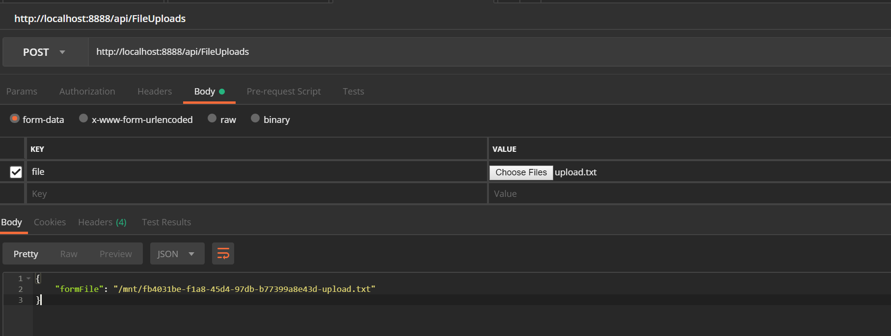
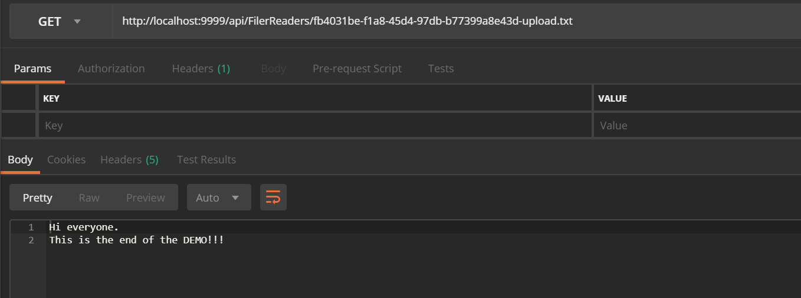

# Spike Abstraction for rates files upload

## Docker

### Create a docker image for `FileUpload`:  
CD to `FileUpload` project folder and run the command:
```
docker build -t eu.gcr.io/parcel-vision/file-upload:1.0 .
```
### Push the image to our Google Container Registry (GCR)

Run the following command: 

```
docker push eu.gcr.io/parcel-vision/file-upload:1.0
```

### Create a docker image for `FileReader`:   
CD to `FileReader` project folder and run the command:
```
docker build -t eu.gcr.io/parcel-vision/file-reader:1.0 .
```

### Push the image to our GCR

Run the following command: 
```
docker push eu.gcr.io/parcel-vision/file-reader:1.0
```

## Files Persistence

### Create Persistent Disk in Google Compute Engine

```
gcloud compute disks create --size=10GB --zone=europe-west2-a gce-nfs-disk
```
Alternatively, you can create this manually using the GCP UI as well.

### Create Persistent Volume and Persistent Volume Claims

CD to `K8s/deploy` and apply this configuration by running the following.

```
kubect apply -f storage.yaml
```

## FileUpload application

CD to `K8s/deploy` and apply this configuration by running the following.

```
kubectl apply -f upload-deploy.yaml
```

## FileReader application

CD to `K8s/deploy` and apply this configuration by running the following.

```
kubectl apply -f download-deploy.yaml
```

## Bonus: running docker on your local machine

### Create docker images
```
docker build -t file-upload:1.0 .
```
```
docker build -t file-reader:1.0 .
```

Run an instance of file-upload
```
docker run -it -p 8888:8888 --name fileupload-001 -v shared_vol:/shared_vol file-upload
```

Run an instance of file-reader
```
docker run -it -p 9999:9999 --name filereader-001 -v shared_vol:/shared_vol file-reader
```

Check that the volume `shared_vol` has been created:
```
docker volume list
DRIVER              VOLUME NAME
local               shared_vol
```

Use Postman to upload a file



Use Postman to read a file

